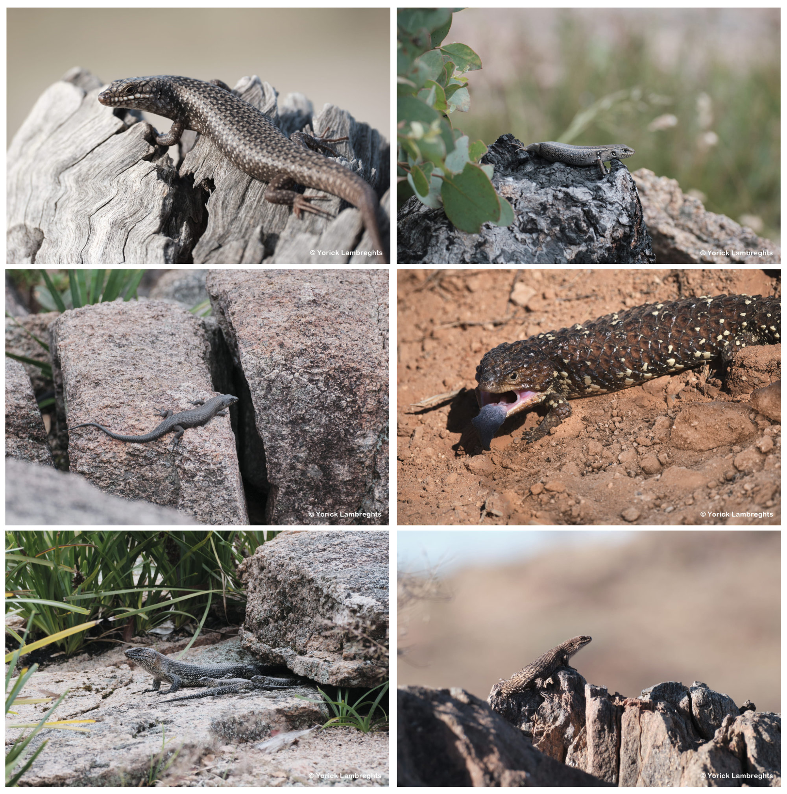

## Summary

**Family living** is an important aspect of social behaviour in species throughout the animal kingdom. The organisation of family groups varies across species, from simple family life, such as that where offspring are tolerated on the parental territory, to highly complex family structures, such as that found in eusocial insects. This variation has captivated behavioural and evolutionary biologists for decades. As a result, there has been substantial work to explain how complex family organisation comes about in the first place. Family living initially arises when offspring forgo immediate dispersal, for instance due to ecological constraints (e.g., no available territories), and remain with one or both parents instead. Kin selection is thought to play an important role in this group formation through the inclusive fitness benefits provided by cooperating with related conspecifics. An implicit assumption to preferential cooperation with kin is that individuals recognise their relatives, a process called **kin recognition**. Nevertheless, the precise relationship between kin recognition and the evolution of family organisation, as well as the factors that have influenced the emergence of kin ecognition itself, remain largely unknown. 

During my PhD, I addressed this knowledge gap by investigating which factors could have influenced the early development of kin recognition and its links with family living. I started by leveraging the existing literature to outline the potential role that the prenatal environment plays in mediating the emergence of kin recognition preferences. I discuss the potential social environment in which embryos develop and illustrate how the close social associations of embryos can provide a foundation for early learning of kin characteristics for postnatal recognition. Various aspects of the developmental setting (e.g., clutch size, gestation period or intrauterine position) affect communication opportunities, and thus constrain or promote associations which could give rise to the development of kin recognition. Such effects are expected to be particularly pronounced in species with viviparous (live bearing) reproduction as opposed to oviparity (egg laying), where physical barriers constrain communication. To that end, I empirically tested how reproductive mode affects kin discrimination. I used the lizard species _Saiphos equalis_, which exhibits intraspecific variation in reproductive mode, a trait rare amongst vertebrates. My results unexpectedly did not suggest any effect of reproductive mode on kin discrimination, for which I propose several potential explanations. 

I then applied behavioural, chemical, and genetic analysis to uncover the relationship between kin recognition and complex sociality. For a model system leverage a group of Australian family-living skinks, collectively called the Egernia group, which exhibit high diversity in family structure, from largely solitary to communal living species. To achieve this, I first compared kin discrimination between Egernia group species with differing levels of social complexity: _Eulamprus quoyii_ (non-Egernia outgroup), _Liopholis whitii_, and _Egernia saxatilis_. I show that _E. saxatilis_ exhibits kin discrimination soon after birth, but no longer at four months of age. No kin discrimination was observed within either _L. whitii_ or _E. quoyii._ I then conducted a detailed analysis of chemical compounds found in scats, which are known to be involved in communication, of five species: _E. quoyii_, _L. whitii_, _E. saxatilis_, _Egernia cunninghami_, and _Tiliqua rugosa_. I found strong intraspecific differences in the chemical composition of scats. This variation in chemical composition showed putative links to variation in sociality; however, other factors such as diet, phylogeny or climate may also play a role. Finally, I utilised one species of Egernia, _L. whitii_, to test the links between differences in the chemical structure between individuals and their pairwise relatedness. If scats provide kin cues, they are expected to contain genotypic signals. My results suggest a weak link between chemical and genotypic similarity between individuals, however, the strength of the signal conforms to that found in other systems. 

 juvenile.")

Combined, my results provide a valuable contribution to our understanding of the origin of kin recognition and the factors that may be involved in its evolution. My thesis highlights the potential of squamate reptiles, lizards in particular, for questions regarding social behaviour. Their variation in reproductive strategies and social complexity, both between and within species provide unique advantages that are lacking to varying degrees in mammals, birds or social insects

## Study system

### Egernia group

My biggest model system consists of a group of 60 species across seven Australian skink genera (*Egernia*, *Liopholis*, *Bellatorias*, *Lissolepis*, *Tiliqua*, *Cyclodomorphus* and *Corucia*) collectively referred to as the Egernia group or Egerniinae. The group separates itself from most other lizards with its high variation in complexity of social structures. While most lizards are solitary, species of the Egernia group display a wide variation in social structures from solitary (e.g., *Tiliqua rugosa*) all the way to species living in large communal groups (e.g., *Egernia cunninghami*) and everything in between. This variation makes them an excellent system to investigate the initial evolution of sociality and related behaviour, such as kin recognition. 

### Saiphos

My second model system consists of the Australian skink *Saiphos equalis* or three-toed skink. These skinks have an unusual fossorial (i.e., have a burrowing lifestyle) and nocturnal ecology. However, it is not their lifestyle that makes them so interesting from a kin recognition perspective, but its unique mode of reproduction. *Saiphos* is one of ~eight lizard species with well-documented bimodal reproduction, which means that females of some populations (typically lower elevation) lay eggs (oviparity), while females from other populations (higher elevations) give birth to live young (viviparity). In reality the distinction is not black and white and individuals can be positioned along a continuum from ‘true’ egg laying to ‘true’ live bearing. This is in contrast to the vast majority of vertebrates in which the entire species either gives birth to live young or lays eggs. Their unique trait makes *S. equalis* ideal to answer specific questions regarding the influence of reproductive mode on different traits, such as kin recognition. They allow for intraspecific methods to be used without many of the confounding factors that are inevitable when using interspecific methods.

 Sydney population. Right: juvenile in \"egg\" consisting of non-calcified membrane from live bearing population from Mount Mackenzie Nature Reserve (Northern NSW).")

